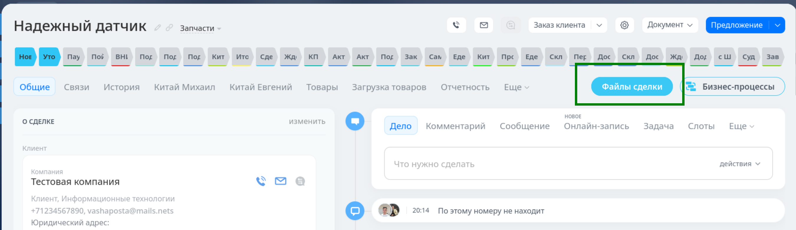
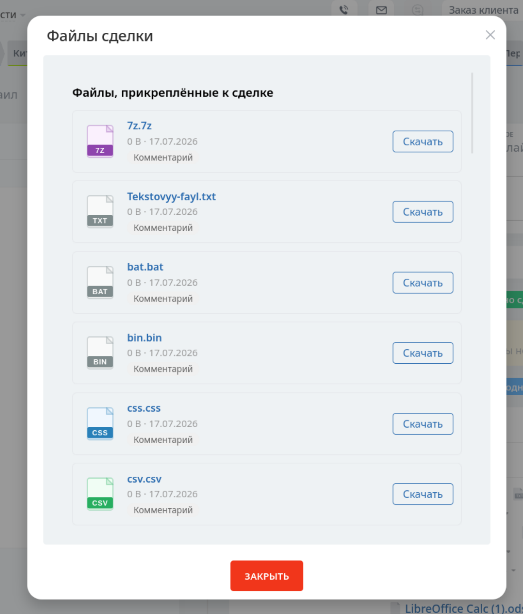
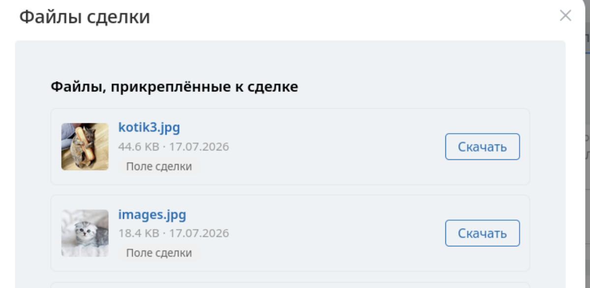

# derykams.dealfileslist — Файлы сделки в один клик

Модуль для **Bitrix24 Коробка**, который добавляет в детальную карточку сделки кнопку **«Файлы сделки»**. Кнопка открывает всплывающее окно (popup) со списком всех файлов, прикреплённых к сделке — из пользовательских полей и из комментариев в таймлайне.

---

## Зачем нужен модуль

В стандартной карточке сделки Bitrix24 файлы разбросаны по разным местам: одни лежат в пользовательских полях (вкладка «Доп. поля»), другие — в комментариях таймлайна. Чтобы найти нужный документ, менеджеру приходится прокручивать карточку, открывать разные вкладки и искать файлы по отдельности.

Этот модуль собирает все файлы в один список — в один клик.

---

## Что делает

- Добавляет кнопку **«Файлы сделки»** в карточку сделки (рядом с кнопкой бизнес-процессов)
- По клику открывает popup со списком всех файлов сделки
- Показывает для каждого файла:
  - SVG-иконку с расширением (PDF, XLSX, ZIP и т.д. — с цветовой кодировкой по типу)
  - Название файла (как ссылка для скачивания)
  - Размер и дату
  - Бейдж источника — «Поле сделки» или «Комментарий»
  - Кнопку «Скачать»
- Для изображений — показывает миниатюру вместо иконки
- Файлы скачиваются через безопасный прокси (проверка прав доступа)
- Иконки файлов кэшируются на сервере — генерируются один раз, дальше отдаются как статические SVG

---

## Источники файлов

Модуль собирает файлы из двух источников:

1. **Пользовательские поля сделки типа «Файл»** (UF_CRM_*) — файлы, загруженные через кастомные поля в карточке сделки. Скачивание через встроенный прокси `download.php` с проверкой принадлежности файла к сделке.

2. **Комментарии в таймлайне сделки** — файлы, прикреплённые к комментариям в ленте сделки. Работает через интеграцию модуля Disk (коннектор `Bitrix\Crm\Integration\Disk\CommentConnector`). Скачивание через стандартный endpoint Bitrix24, который сам проверяет права доступа.

---

## Скриншоты

### Кнопка в карточке сделки

Кнопка появляется в карточке сделки, рядом с кнопкой бизнес-процессов.

### Popup со списком файлов

Всплывающее окно со списком всех файлов сделки — из полей и из комментариев. Каждый файл показывает иконку, название, размер, дату и источник.

Иконки генерируются автоматически по расширению файла, с цветовой кодировкой: PDF — красный, XLSX — зелёный, ZIP — фиолетовый и т.д. Иконки кэшируются на сервере после первой генерации.

### Изображения в списке

Если файл — изображение (JPG, PNG, GIF), вместо иконки показывается миниатюра. Клик по миниатюре открывает файл в новой вкладке.

---

## Установка

### Требования

- Bitrix24 Коробка (on-premise)
- Модуль CRM (входит в стандартную поставку)
- Модуль Disk (входит в стандартную поставку, для файлов из комментариев)
- PHP 8.0+

### Установка через админку

1. Скопируйте папку `derykams.dealfileslist/` в `/local/modules/` на вашем сервере Bitrix24
2. Перейдите в админку: **Маркетплейс → Установленные решения** (`/bitrix/admin/partner_modules.php`)
3. Найдите модуль **«Файлы сделки»** в списке
4. Нажмите **«Установить»**
5. Готово — кнопка появится в карточках сделок автоматически

---

## Удаление

1. Перейдите в **Маркетплейс → Установленные решения**
2. Найдите модуль и нажмите **«Удалить»**
3. Модуль снимет обработчики событий, удалит кэш иконок и разрегистрируется

Папка модуля на сервере остаётся — удалите её вручную, если нужно.

---

## Технические детали

### Как это работает

1. При установке модуль регистрирует обработчик события `main:OnProlog`
2. На каждой странице Bitrix24 обработчик проверяет URL — если это `/crm/deal/details/ID/`, подключается `dealfiles.js`
3. JS через `MutationObserver` ждёт появления контейнера `.crm-entity-bizproc-container` и вставляет в него кнопку
4. По клику — AJAX-запрос к `get_deal_files.php`, который собирает файлы из UF-полей и комментариев таймлайна
5. JS открывает popup `BX.PopupWindowManager` со списком файлов
6. SVG-иконки запрашиваются через `get_icon.php` — генерируются один раз и кэшируются в папке `icons/`

### Кэширование иконок

- При первом запросе иконки для расширения (например, `.rb`) — `get_icon.php` генерирует SVG и сохраняет в `icons/rb.svg`
- При последующих запросах — отдаётся готовый файл без генерации
- Браузер кэширует ответ через `Cache-Control: immutable`
- При удалении модуля папка `icons/` очищается автоматически

---

## Совместимость

- Bitrix24 Коробка (тестировалось на PHP 8.x)
- Модуль использует D7 ORM (Bitrix\Main, Bitrix\Crm\Timeline, Bitrix\Disk)
- Работает в SPA-режиме карточки сделки (через MutationObserver)
- Не изменяет ядро Bitrix24 — только добавляет JS-кнопку и AJAX-эндпоинты
